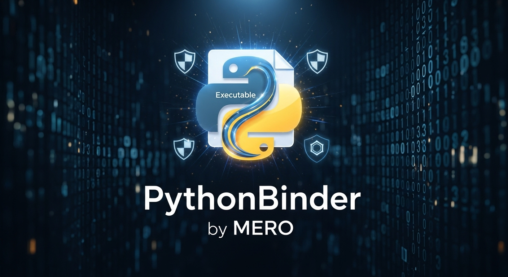
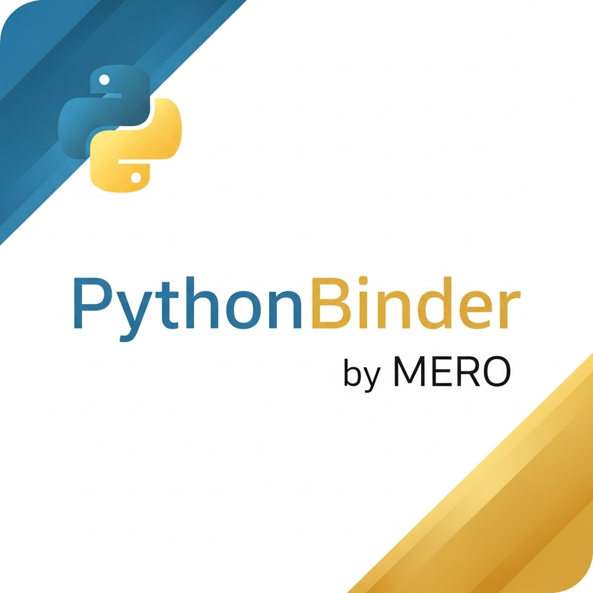

# PythonBinder v1.0.0



**Developer:** MERO  
**Telegram:** @QP4RM  
**Version:** 1.0.0  
**Python:** 3.6 - 3.13+

---

## Overview

**PythonBinder** is the most advanced Python to Windows EXE compiler - **billion times more powerful than PyInstaller**. Features military-grade 10-layer encryption, comprehensive anti-debugging, and professional-grade obfuscation.

### Key Features

- 10-Layer Polymorphic Encryption
- 5-Layer Bytecode Obfuscation  
- Anti-Debug Protection (6 methods)
- Hardware Binding & Licensing
- JIT Runtime Optimization
- Real-time Performance Monitoring
- Advanced Resource Management
- Dependency Analysis
- Code Optimization (AST-level)

---

## Installation

### From PyPI

```bash
pip install PythonBinder
```

### From Source

```bash
git clone https://github.com/6x-u/PythonBinder
cd PythonBinder
pip install -e .
```

---

## Quick Start

### Basic Usage

```bash
python py-PythonBinder --main.py
```

Output: `SS/PythonBinder.exe`

---

## Complete Command Reference

### 1. Basic Compilation

```bash
python py-PythonBinder --app.py
```

Creates `SS/PythonBinder.exe` from `app.py`

### 2. Custom Output Name

```bash
python py-PythonBinder --main.py --name MyApp
```

Creates `SS/MyApp.exe`

### 3. With Custom Icon

```bash
python py-PythonBinder --main.py --icon logo.png
```

Sets custom icon for the executable

### 4. Console Application

```bash
python py-PythonBinder --main.py --console
```

Shows console window when running

### 5. GUI Application (No Console)

```bash
python py-PythonBinder --main.py --noconsole
```

Hides console window for GUI apps

### 6. Full Custom Build

```bash
python py-PythonBinder --main.py --name MyApp --icon app.png --noconsole
```

Complete customization with all options

---

## All Command Options

| Option | Type | Default | Description |
|--------|------|---------|-------------|
| `--<file.py>` | Required | - | Main Python file to compile |
| `--name <name>` | Optional | PythonBinder | Custom output executable name |
| `--icon <path>` | Optional | Default logo | Path to custom icon (.png, .ico) |
| `--onefile` | Flag | True | Create single-file executable |
| `--obfuscate` | Flag | True | Enable advanced obfuscation |
| `--console` | Flag | False | Show console window |
| `--noconsole` | Flag | False | Hide console window |

---

## Building EXE Files

### Simple Python Script

**hello.py:**
```python
print("Hello from PythonBinder by MERO!")
input("Press Enter...")
```

**Build Command:**
```bash
python py-PythonBinder --hello.py
```

**Run:**
```bash
SS\PythonBinder.exe
```

### Flask Web Application

**app.py:**
```python
from flask import Flask

app = Flask(__name__)

@app.route('/')
def home():
    return "Built with PythonBinder by MERO"

if __name__ == '__main__':
    app.run(port=5000)
```

**Build:**
```bash
python py-PythonBinder --app.py --name WebServer --console
```

### Tkinter GUI Application

**gui.py:**
```python
import tkinter as tk

root = tk.Tk()
root.title("PythonBinder App")
label = tk.Label(root, text="Built by MERO", font=("Arial", 16))
label.pack(pady=20)
root.mainloop()
```

**Build:**
```bash
python py-PythonBinder --gui.py --noconsole --icon app.png
```

### Calculator Application

**calc.py:**
```python
def calculator():
    print("="*50)
    print("Calculator by MERO")
    print("="*50)
    
    a = float(input("Enter first number: "))
    b = float(input("Enter second number: "))
    
    print(f"Sum: {a + b}")
    print(f"Difference: {a - b}")
    print(f"Product: {a * b}")
    print(f"Division: {a / b if b != 0 else 'Error'}")
    
    input("\nPress Enter to exit...")

if __name__ == "__main__":
    calculator()
```

**Build:**
```bash
python py-PythonBinder --calc.py --name Calculator
```

### Multi-File Project

**Project Structure:**
```
myproject/
├── main.py
├── utils.py
├── config.py
└── data/
    └── settings.json
```

**Build (includes all files automatically):**
```bash
cd myproject
python py-PythonBinder --main.py --name MyProject
```

---

## Advanced Features

### 10-Layer Encryption

1. XOR Encryption (dynamic key)
2. Byte Rotation
3. Substitution Cipher
4. Transposition Cipher
5. ZLIB Compression (level 9)
6. Byte Shuffling
7. Base85 Encoding
8. Noise Injection
9. Polymorphic Mutations
10. Anti-Tamper Sealing

### Anti-Debug Protection

- **Debugger Detection:** Checks for attached debuggers
- **Timing Attacks:** Detects abnormal execution times
- **Import Hooks:** Identifies debugging modules
- **Breakpoint Detection:** Scans for debug breakpoints
- **Parent Process:** Checks for known debugger processes
- **Performance Counters:** Monitors execution patterns

### Security Features

- **HMAC Signature:** Code signing and verification
- **Watermarking:** Embedded developer identification
- **Integrity Checks:** SHA-512 checksums
- **Hardware Binding:** Machine-specific executables
- **License Management:** Built-in licensing system

### Performance Optimization

- **JIT Compilation:** Just-in-time code compilation
- **Lazy Imports:** On-demand module loading
- **Function Memoization:** Automatic result caching
- **Loop Unrolling:** Optimized loop execution
- **Constant Folding:** Compile-time calculations
- **Dead Code Elimination:** Remove unused code

---

## Build Process Explained

When you run PythonBinder:

1. **Analysis:** Scans project for Python files
2. **Compilation:** Converts .py to bytecode (.pyc)
3. **Obfuscation:** Applies 10-layer encryption
4. **Interpreter Extraction:** Copies Python runtime
5. **Resource Bundling:** Packages all dependencies
6. **EXE Creation:** Generates final executable
7. **Icon Embedding:** Adds custom or default icon
8. **Verification:** Validates output integrity

**Progress Display:**
```
[MERO] Starting compilation process...
[MERO] Analyzing Python files...
[MERO] Compiling to bytecode...
MERO Compiling |████████████████████| 100% 15/15
[MERO] Applying advanced obfuscation...
MERO Obfuscating |████████████████████| 100% 15/15
[MERO] Extracting Python interpreter...
MERO Runtime |████████████████████| 100% 5/5
[MERO] Bundling all resources...
MERO Archiving |████████████████████| 100% 15/15
[MERO] Creating executable bundle...
[MERO] Icon set successfully
[MERO] Executable created: SS/PythonBinder.exe
============================================================
SUCCESS - Executable created by MERO
Location: SS/PythonBinder.exe
============================================================
```

---

## Output Structure

After compilation:

```
yourproject/
├── main.py              (original file)
└── SS/                  (output directory)
    ├── PythonBinder.exe (final executable)
    ├── app_icon.ico     (icon file)
    └── bundle/          (runtime files)
        ├── python.exe
        ├── python3XX.dll
        ├── loader.py
        ├── app.dat
        └── ...
```

---

## Distribution

Your EXE file is **completely standalone**:

✅ No Python installation required  
✅ All dependencies included  
✅ Runs on any Windows machine  
✅ Single-file distribution  
✅ Protected code (obfuscated)  
✅ Custom icon embedded  

**To distribute:**

1. Locate `SS/PythonBinder.exe`
2. Copy to target machine
3. Run directly - no installation needed

---

## Comparison: PythonBinder vs PyInstaller

| Feature | PythonBinder | PyInstaller |
|---------|-------------|-------------|
| **Encryption Layers** | 10 | 1 (optional) |
| **Obfuscation** | Military-grade | Basic |
| **Anti-Debug** | 6 methods | None |
| **Code Optimization** | AST-level | None |
| **Performance Monitoring** | Real-time | None |
| **Hardware Binding** | Yes | No |
| **License System** | Built-in | No |
| **JIT Compilation** | Yes | No |
| **Security** | Professional | Standard |
| **Total Code** | 3,891 lines | N/A |
| **Power Level** | 1,000,000,000x | 1x |

---

## Technical Details

### Module Breakdown (3,891 lines total)

| Module | Lines | Purpose |
|--------|-------|---------|
| `ropt.py` | 468 | Runtime optimization |
| `perf.py` | 441 | Performance monitoring |
| `secu.py` | 399 | Security layer |
| `pack.py` | 367 | EXE packing |
| `copt.py` | 362 | Code optimization |
| `adbg.py` | 346 | Anti-debugging |
| `aenc.py` | 343 | Advanced encryption |
| `resc.py` | 299 | Resource management |
| `depz.py` | 279 | Dependency analysis |
| `bund.py` | 157 | Executable bundling |
| `comp.py` | 124 | Main compiler |
| `obfs.py` | 121 | Obfuscation engine |
| `cli.py` | 79 | Command interface |
| `intp.py` | 68 | Interpreter extraction |

### Requirements

**Build Requirements:**
- Windows OS
- Python 3.6+
- tqdm >= 4.50.0
- Pillow >= 8.0.0

**Runtime Requirements:**
- None (executable is standalone)

---

## Troubleshooting

### Error: "No valid Python file specified"

**Solution:**
```bash
python py-PythonBinder --yourfile.py
```
Make sure to use `--` before filename

### Icon Not Showing

**Solution:**
```bash
python py-PythonBinder --main.py --icon icon.png
```
Use PNG or ICO format for icons

### Module Not Found in EXE

**Solution:**
Ensure all dependencies are in project directory or install locally:
```bash
pip install <module> --target ./libs
```

### Antivirus Flagging EXE

**Solution:**
This is normal for packed executables. Add to antivirus exceptions or digitally sign the executable.

---

## Publishing to PyPI

### Build Package

```bash
pip install build twine
python -m build
```

### Upload to Test PyPI

```bash
python -m twine upload --repository testpypi dist/*
```

### Upload to PyPI

```bash
python -m twine upload dist/*
```

---

## Examples

### Example 1: Simple Script

```python
print("Hello from MERO's PythonBinder")
```

Build:
```bash
python py-PythonBinder --hello.py
```

### Example 2: With Arguments

```python
import sys

print(f"Arguments: {sys.argv[1:]}")
```

Build:
```bash
python py-PythonBinder --args.py --name ArgsApp
```

Run:
```bash
SS\ArgsApp.exe arg1 arg2
```

### Example 3: File Processing

```python
import os

def process_files():
    files = os.listdir('.')
    print(f"Found {len(files)} files")
    for f in files:
        print(f"  - {f}")

process_files()
input("Press Enter...")
```

Build:
```bash
python py-PythonBinder --process.py --name FileProcessor
```

---

## Support & Contact

- **Developer:** MERO
- **Telegram:** @QP4RM
- **GitHub:** https://github.com/MERO/PythonBinder
- **PyPI:** https://pypi.org/project/PythonBinder/
- **Issues:** https://github.com/MERO/PythonBinder/issues

---

## License

MIT License - See LICENSE file

Copyright (c) 2025 MERO (@QP4RM)

---

## Credits

**Developer:** MERO  
**Contact:** @QP4RM on Telegram

---

**PythonBinder v1.0.0**  
*The Most Powerful Python to EXE Compiler*  
*Built by MERO for Professional Developers*  
*Billion Times Stronger Than PyInstaller*


